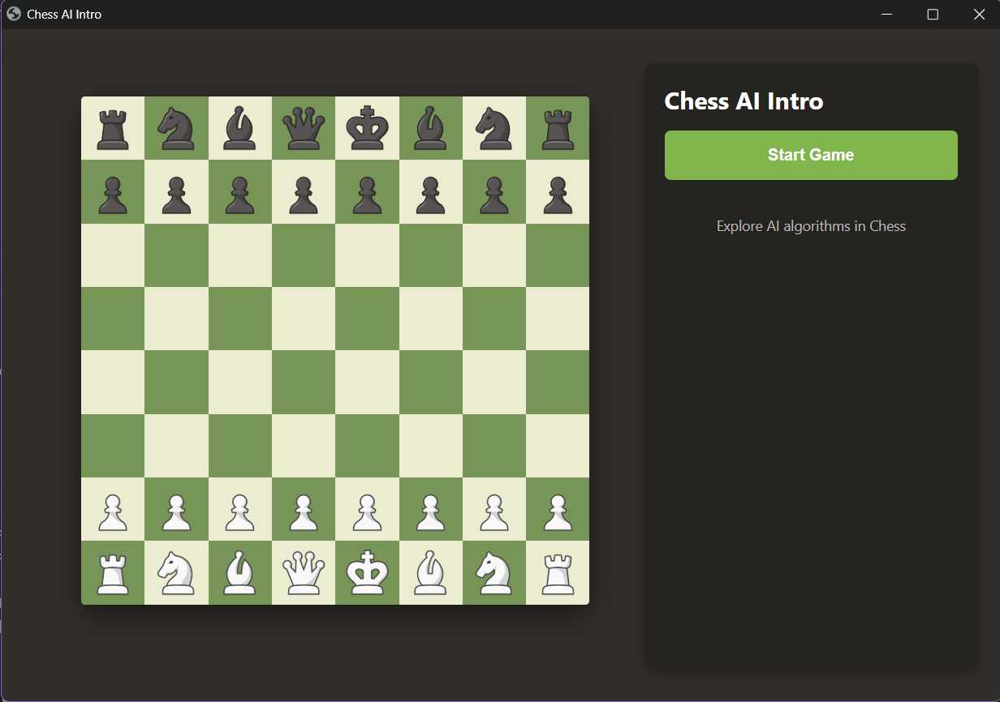
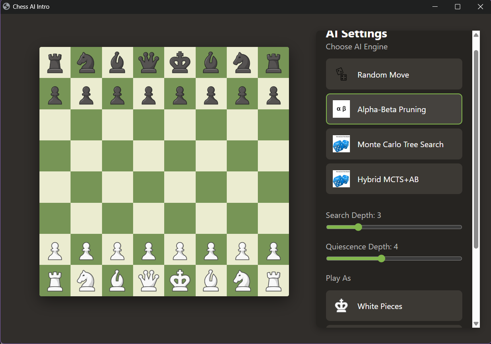
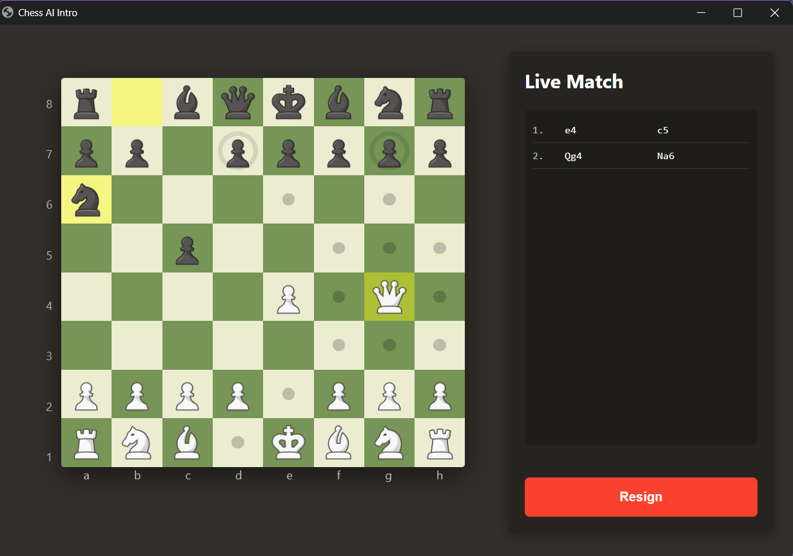
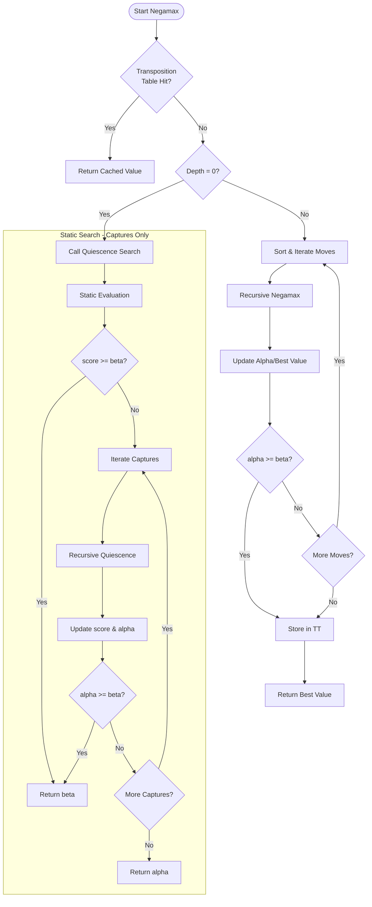
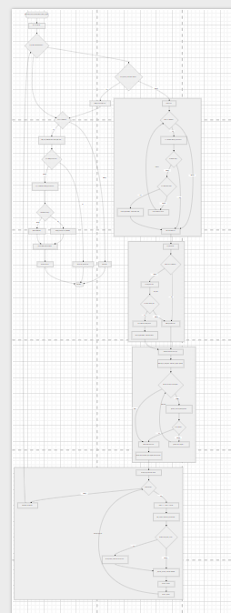

# Chess AI Intro ♟️

A high-performance Chess engine implementation in Python featuring multiple AI algorithms, including **Alpha-Beta Pruning** and **Monte Carlo Tree Search (MCTS)**. This project leverages a modern web-based GUI and optimized search heuristics to challenge players of various skill levels.

---

## 🎬 Featured Demo Match

### Video Demo
https://github.com/user-attachments/assets/d8928556-ecc3-4123-b90a-fc29000c0c02

### Match Log (PGN)
In this high-stakes game, the engine (playing Black) defeats **Wendy (1500 Elo)** on Chess.com using a combination of tactical precision and aggressive endgame pushing.

<details>
<summary><b>View PGN (Alpha-Beta D3-Q4 vs Wendy 1500)</b></summary>

```pgn
[Event "Play vs Bot"]
[Site "Chess.com"]
[Date "2026.04.13"]
[Round "?"]
[White "Wendy"]
[Black "Alpha-Beta (D3, Q4)"]
[Result "0-1"]
[BlackElo "1600"]
[WhiteElo "1500"]
[Termination "by checkmate"]
[ECO "B02"]
[EndDate "2026.04.13"]

1. e4 Nf6 2. e5 Ne4 3. d3 Nc5 4. b4 Ne6 5. a4 Nc6 6. b5 Nxe5 7. Qh5 d6 8. f4 g6 9. Qh4 Nd7 10. Nf3 Bg7 11. d4 Nxd4 12. Nxd4 Bxd4 13. c3 Bf6 14. Qf2 O-O 15. Bd3 Nc5 16. Qf3 Nb3 17. O-O Nxa1 18. f5 gxf5 19. Qe3 e6 20. Qf4 Nb3 21. Bc4 Nc5 22. Be2 e5 23. Qf3 Nxa4 24. Bd3 e4 25. Bxe4 fxe4 26. Qxf6 Qxf6 27. Rxf6 a5 28. bxa6 bxa6 29. Rf4 Nc5 30. Nd2 e3 31. Ne4 e2 32. Kf2 Nd3+ 33. Kxe2 Nxc1+ 34. Kd2 Nb3+ 35. Kc2 Nc5 36. Nf6+ Kg7 37. Nd5 Ra7 38. Ne7 Bb7 39. Nf5+ Kg6 40. Nh4+ Kg5 41. g3 Be4+ 42. Kd2 d5 43. Rf1 a5 44. Ke3 a4 45. Rf2 a3 46. Kd4 Ne6+ 47. Ke5 a2 48. Rf1 a1=Q 49. Rxa1 Rxa1 50. c4 Re1 51. Nf5 Bf3+ 52. Ne3 Rxe3# 0-1
```
</details>

---

## 📸 Visual Showcase

| Main Menu | Game Selection | In-Game UI |
|:---:|:---:|:---:|
|  |  |  |

---

## 🚀 Key Features

- **Advanced AI Algorithms**: Choose between deterministic (Alpha-Beta) and probabilistic (MCTS) opponents.
- **Hybrid Engine**: Experimental MCTS + Alpha-Beta hybrid for balanced strategic play.
- **Modern Web GUI**: Interactive board built with Vanilla JS and CSS, served via `Eel`.
- **Heuristic Evaluation**: Incorporates Piece-Square Tables (PST) and material weights.
- **Move Visualization**: Real-time legal move highlighting and game status detection (checkmate, stalemate, draws).

---

## 🧠 Technical Architecture

### 1. Alpha-Beta Pruning (Negamax & Quiescence)
The engine uses Negamax with Alpha-Beta pruning, enhanced by **Quiescence Search** to mitigate the "Horizon Effect" during tactical exchanges.



### 2. Monte Carlo Tree Search (MCTS)
Implements the 4-stage MCTS cycle: **Selection (UCT)**, **Expansion**, **Simulation (Rollout)**, and **Backpropagation**.



---

## 📊 Performance Benchmarks

The engine was benchmarked against various Chess.com computer levels (Elo 250 - 1800).

### Alpha-Beta Pruning Results
| Depth | Quiescence | Opponent (Elo) | Result | Avg Time/Move |
|:---:|:---:|:---|:---:|:---:|
| 1 | 0 | Beginner (250) | LOST | 0.013s |
| 3 | 0 | Beginner (250) | **WIN** | 0.708s |
| 3 | 2 | Intermediate (1300) | **WIN** | 0.593s |
| 3 | 2 | Komodo (1600) | **WIN** | 0.603s |
| 3 | 2 | Advanced (1800) | DRAW | 0.732s |
| 4 | 3 | Advanced (1800) | DRAW | 14.022s |

### Pure MCTS Results
| Iterations | Depth | Opponent (Elo) | Result | Avg Time/Move |
|:---:|:---:|:---|:---:|:---:|
| 1000 | 5 | Beginner (250) | DRAW (Failed to mate) | ~30s |
| 5000 | 5 | Intermediate (850) | LOST | ~45s |
| 300 | 20 | Alpha-Beta (D2, Q2) | LOST (20/20 games) | ~40s |

### Hybrid Engine (MCTS + AB) Results
| Iterations | Top-K | Opponent (Elo) | Result | Avg Time/Move |
|:---:|:---:|:---|:---:|:---:|
| 3000 | 6 | Beginner (700) | **WIN** | ~14s |
| 3000 | 6 | Intermediate (1000) | LOST | ~30s |
| 5000 | 6 | Alpha-Beta (D4) | LOST | ~47s |

---

## 🛠️ Tech Stack

- **Core**: Python 3.12
- **Game Logic**: `python-chess`
- **GUI Bridge**: `Eel` (Chromium-based)
- **Frontend**: HTML5, CSS3, JavaScript (ES6)

---

## 📦 Installation & Usage

1. **Clone & Enter**:
   ```bash
   git clone https://github.com/DucMinh2211/chess-ai-intro-252.git
   cd chess-ai-intro-252
   ```

2. **Setup Environment**:
   ```bash
   pip install -r requirements.txt
   ```

3. **Run**:
   ```bash
   python main.py
   ```

---

## 📂 Project Structure

```text
├── main.py              # Entry point & Eel bridge
├── model/               # AI Algorithms
│   ├── alpha_beta.py    # Minimax, PST, Quiescence
│   ├── mcts.py          # MCTS implementation
│   └── evaluation.py    # Static heuristic functions
├── UI/                  # Frontend assets (HTML/CSS/JS)
├── latex/               # Technical Report & Diagrams
└── assets/              # Game resources
```

---
*Developed as an introductory exploration into AI Search Algorithms and Heuristics.*
