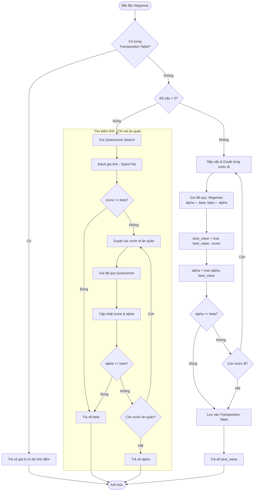
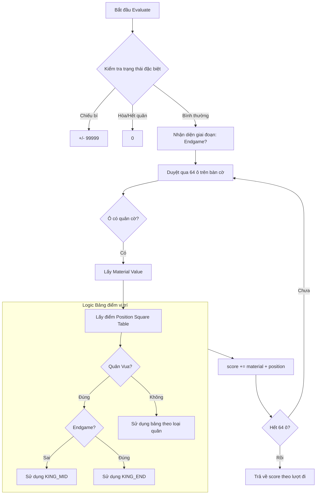
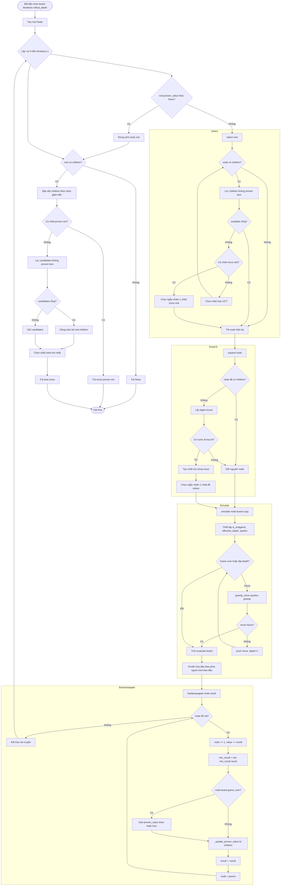

# Biểu đồ thuật toán Alpha-Beta Pruning (Negamax & Quiescence Search)

## 1. Sơ đồ luồng điều khiển tích hợp Quiescence Search
Sơ đồ này mô tả cấu trúc của Negamax kết hợp với Quiescence Search để giải quyết "hiệu ứng đường chân trời".



## 2. Luồng Logic Đánh giá (Evaluation Flow)
Sơ đồ mô tả cách hàm `evaluate` tính toán điểm số thế trận.



## 3. Biểu đồ logic flow thuật toán MCTS
Sơ đồ dưới đây bám theo luồng chính trong `model/mcts.py`: lặp `select -> expand -> simulate -> backpropagate`, có dừng sớm khi trạng thái được chứng minh (proven value), rồi chọn nước đi cuối cùng theo độ ưu tiên.



## 4. Mã giả 4 giai đoạn của MCTS
Phần này tách riêng từng giai đoạn cốt lõi để dễ trình bày trong báo cáo.

### 4.1 Selection
```text
FUNCTION SELECT(node):
    WHILE node has children:
        available <- children with proven_value != -INF
        IF available is empty:
            RETURN node

        unvisited <- children in available with visits = 0
        IF unvisited is not empty:
            RETURN RANDOM_CHOICE(unvisited)

        node <- ARGMAX(available, UCT)

    RETURN node
```

### 4.2 Expansion
```text
FUNCTION EXPAND(node):
    IF node already has children:
        RETURN node

    moves <- LEGAL_MOVES(node.board)
    IF moves is empty:
        RETURN node

    FOR each move in moves:
        b <- COPY(node.board)
        PUSH(b, move)
        ADD_CHILD(node, NEW_NODE(b, parent=node))

    RETURN RANDOM_CHOICE(node.children)
```

### 4.3 Simulation (Rollout)
```text
FUNCTION SIMULATE(board, rollout_depth):
    mover <- OPPOSITE(board.turn)
    depth <- 0

    total_pieces <- COUNT_PIECES(board)
    is_endgame <- (total_pieces <= 16)

    IF is_endgame:
        effective_depth <- MAX(rollout_depth, 20)
        epsilon <- 0.15
        top_k <- 3
    ELSE:
        effective_depth <- rollout_depth
        epsilon <- 0.35
        top_k <- 5

    WHILE NOT GAME_OVER(board) AND depth < effective_depth:
        move <- GREEDY_MOVE(board, top_k, epsilon)
        IF move is NONE:
            BREAK
        PUSH(board, move)
        depth <- depth + 1

    result <- EVALUATE(board)

    IF ABS(result) > 0.9:
        speed <- (effective_depth - depth + 1) / (effective_depth + 1)
        result <- result * (0.95 + 0.05 * speed)

    IF mover == WHITE:
        RETURN result
    ELSE:
        RETURN -result
```

### 4.4 Backpropagation
```text
FUNCTION BACKPROPAGATE(node, result):
    WHILE node is not NULL:
        node.visits <- node.visits + 1
        node.value <- node.value + result
        node.min_result <- MIN(node.min_result, result)

        IF GAME_OVER(node.board):
            outcome <- OUTCOME(node.board)
            IF outcome.winner is NULL:
                node.proven_value <- 0.0
            ELSE:
                node.proven_value <- -INF

        UPDATE_PROVEN_VALUE_FROM_CHILDREN(node)

        result <- -result
        node <- node.parent
```

### 4.5 Khung vòng lặp MCTS đầy đủ
```text
FUNCTION MCTS(board, iterations, rollout_depth):
    root <- NEW_NODE(board)

    FOR i from 0 to iterations - 1:
        IF root.proven_value is not NULL:
            BREAK

        node <- SELECT(root)
        node <- EXPAND(node)
        result <- SIMULATE(COPY(node.board), rollout_depth)
        BACKPROPAGATE(node, result)

    IF root has no children:
        RETURN NONE

    proven_wins <- children of root with proven_value = +INF
    IF proven_wins is not empty:
        RETURN MOVE_OF(proven_wins[0])

    candidates <- children of root with proven_value != -INF
    IF candidates is empty:
        candidates <- root.children

    best <- ARGMAX(candidates, visits)
    RETURN MOVE_OF(best)
```
