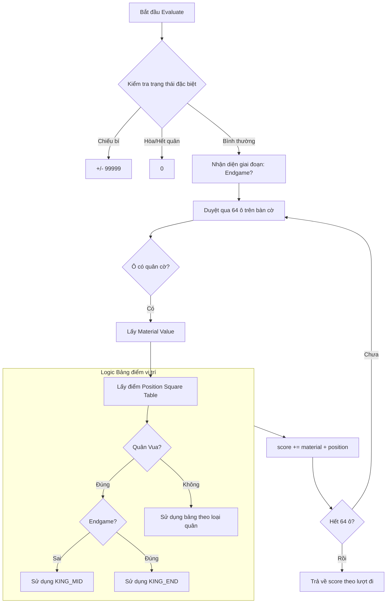

# Biểu đồ thuật toán Alpha-Beta Pruning (Negamax & Quiescence Search)

## 1. Sơ đồ luồng điều khiển tích hợp Quiescence Search
Sơ đồ này mô tả cấu trúc của Negamax kết hợp với Quiescence Search để giải quyết "hiệu ứng đường chân trời".

## 2. Luồng Logic Đánh giá (Evaluation Flow)
Sơ đồ mô tả cách hàm `evaluate` tính toán điểm số thế trận.

